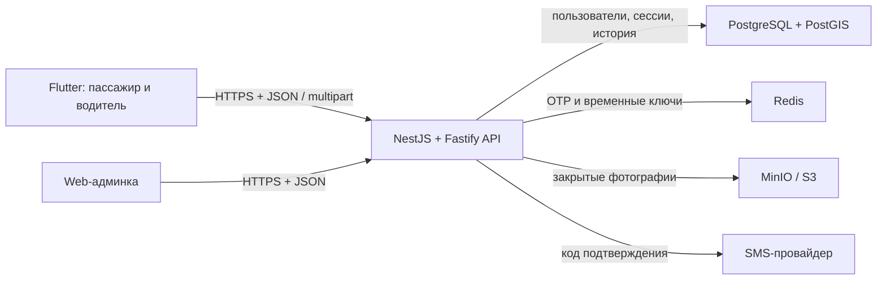

# Как устроен backend «Такси Бгр»

Это подробное учебное руководство по уже реализованному backend. Оно рассчитано
на человека, который знает основы программирования, но раньше почти не работал с
серверной разработкой.

В документе указаны файлы и актуальные номера строк. Номера строк относятся к
состоянию проекта на момент написания руководства. После дальнейшего изменения
кода они могут немного сдвинуться, поэтому рядом всегда указаны названия классов
и методов, по которым нужное место легко найти.

## 1. Что вообще называется backend

Мобильное приложение не должно само:

- хранить общий список пользователей;
- решать, верен ли SMS-код;
- выдавать себе права администратора;
- утверждать анкету водителя;
- хранить водительские документы;
- рассчитывать окончательную цену заказа;
- определять, кому показывать заказ;
- считать долги, комиссии и зарплаты.

Если оставить это в Flutter, пользователь сможет изменить приложение на своем
телефоне и подменить результат. Поэтому Flutter отвечает за интерфейс, а backend
является доверенной стороной и принимает окончательные решения.

Пример:

1. Flutter отправляет backend номер телефона.
2. Backend создает SMS-код и сохраняет его защищенное представление.
3. Пользователь вводит код.
4. Backend проверяет код и решает: войти в существующий аккаунт или разрешить
   регистрацию нового.
5. Flutter сохраняет полученную сессию и использует ее при следующих запросах.

Backend в этом проекте представляет собой HTTP API. Приложение посылает ему
HTTP-запросы, обычно с JSON, а API возвращает HTTP-ответы с JSON.

```text
POST /api/v1/auth/otp/request
Content-Type: application/json

{ "phone": "+79141234567" }
```

Успешный ответ в локальном режиме:

```json
{
  "challengeId": "9b6a...uuid...",
  "expiresInSeconds": 300,
  "resendAfterSeconds": 60,
  "debugCode": "123456"
}
```

`debugCode` существует только для разработки. В production код нельзя
возвращать приложению, иначе подтверждение номера теряет смысл.

## 2. Общая архитектура

Используется **модульный монолит**. Это одно серверное приложение, но код внутри
разделен на модули по ответственности.



Главное решение описано в `docs/architecture.md:5-18`. Сейчас разделять систему
на микросервисы невыгодно: на старте ожидаются единицы водителей и десятки
заказов в день. Один процесс проще разрабатывать, тестировать и размещать.

При этом границы модулей уже позволяют позднее вынести геопозицию, уведомления
или распределение заказов в отдельные процессы. Это описано в
`docs/architecture.md:74-83`.

### 2.1. Что где хранится

**PostgreSQL** хранит постоянные и связанные данные:

- пользователей;
- анкеты водителей;
- серверные сессии;
- историю решений администратора;
- аудит действий;
- будущие зоны, заказы, поездки, тарифы и платежи.

**Redis** хранит короткоживущие данные:

- SMS-коды;
- счетчики частоты отправки SMS;
- признак, что регистрационный токен еще не использован;
- в будущем — быстро меняющиеся координаты водителей и временные блокировки.

**MinIO** хранит бинарные объекты:

- фото прав;
- четыре фото автомобиля;
- необязательный аватар пассажира.

В PostgreSQL лежит не само изображение, а строка-ключ вроде:

```text
registrations/<registration-jti>/license/<uuid>.jpg
```

Это разделение важно. База данных хорошо работает со строками, связями и
транзакциями, но фотографии удобнее и дешевле хранить в S3-совместимом
объектном хранилище.

## 3. Используемый стек

Основные зависимости перечислены в `package.json:37-59`.

| Компонент | Роль |
| --- | --- |
| Node.js 22 | Среда выполнения TypeScript/JavaScript |
| TypeScript | Язык backend с проверкой типов |
| NestJS 11 | Структура приложения, модули, DI, контроллеры и guards |
| Fastify | HTTP-сервер внутри NestJS |
| TypeORM | Работа с PostgreSQL через entity и migrations |
| PostgreSQL 17 | Основная реляционная база |
| PostGIS | Геометрия зон и будущие пространственные запросы |
| Redis + ioredis | OTP, лимиты и временное состояние |
| MinIO | Локальное S3-совместимое хранилище документов |
| Sharp | Проверка и нормализация изображений |
| JWT | Короткоживущие access- и registration-токены |
| class-validator | Проверка входящих DTO |
| Swagger | Интерактивное описание API |
| Jest + Supertest | Модульные и сквозные тесты |

## 4. Структура проекта

```text
backend/
├── compose.yaml                 локальная инфраструктура
├── Dockerfile                  production-образ API
├── package.json                команды и зависимости
├── src/
│   ├── main.ts                 точка входа
│   ├── configure-app.ts        общие HTTP-настройки
│   ├── app.module.ts           корневой NestJS-модуль
│   ├── commands/               команды, не являющиеся HTTP API
│   ├── config/                 проверка переменных окружения
│   ├── infrastructure/
│   │   ├── database/           TypeORM и migrations
│   │   └── redis/              одно подключение Redis
│   └── modules/
│       ├── auth/               SMS, регистрация и сессии
│       ├── users/              пользователи и анкеты водителей
│       ├── storage/            работа с изображениями
│       ├── admin/              ручная модерация водителей
│       ├── activity-events/    аудит и статистические события
│       ├── outbox/             надежные будущие фоновые события
│       ├── service-zones/      географические зоны
│       └── health/             проверка зависимостей API
└── test/
    └── app.e2e-spec.ts         реальный сквозной сценарий API
```

## 5. Как backend запускается

### 5.1. Инфраструктура Docker

Команда:

```powershell
npm run db:up
```

Она определена в `package.json:24` и запускает `docker compose up -d`.

В `compose.yaml` поднимаются три контейнера:

1. PostgreSQL — `compose.yaml:4-24`.
2. Redis — `compose.yaml:26-45`.
3. MinIO — `compose.yaml:47-63`.

Данные лежат в именованных Docker volumes из `compose.yaml:65-68`. Поэтому
перезапуск контейнера не стирает базу и фотографии.

У каждого сервиса есть `healthcheck`. Docker отличает «процесс запущен» от
«сервис уже готов принимать запросы». Например, PostgreSQL проверяется через
`pg_isready` в `compose.yaml:15-24`.

Redis запускается с AOF и политикой `noeviction` (`compose.yaml:29-35`):

- AOF помогает пережить перезапуск;
- `noeviction` запрещает незаметно выкидывать OTP-ключи при нехватке памяти.

### 5.2. Переменные окружения

Шаблон находится в `.env.example:1-34`. Рабочий `.env` не должен попадать в git,
потому что позже в нем будут настоящие пароли и секреты.

Проверка всех значений находится в
`src/config/environment.validation.ts:3-80`.

Особенно важны:

- `DB_*` — соединение с PostgreSQL;
- `REDIS_URL` — соединение с Redis;
- `S3_*` — соединение с MinIO/S3;
- `SMS_MODE` — `mock` или `disabled`;
- `OTP_HASH_SECRET` — секрет HMAC для OTP;
- `JWT_ACCESS_SECRET` — подпись access JWT;
- `JWT_REGISTRATION_SECRET` — отдельная подпись registration JWT;
- `ACCESS_TOKEN_TTL_SECONDS` — по умолчанию 900 секунд;
- `REFRESH_TOKEN_TTL_DAYS` — по умолчанию 30 дней.

В production схема запрещает `SMS_MODE=mock`
(`environment.validation.ts:40-44`) и требует явные секреты
(`environment.validation.ts:9-20`, `24-39`, `45-69`). Сервер завершит запуск с
ошибкой, а не продолжит работать с учебными паролями.

### 5.3. Миграции базы

Перед первым запуском выполняется:

```powershell
npm run migration:run
```

Команда использует `src/infrastructure/database/data-source.ts:8-25`.

Миграция — это версионированное изменение структуры базы. Она создает таблицы,
типы, индексы и ограничения одинаково на каждом компьютере и сервере.

`synchronize` намеренно выключен:

- `src/infrastructure/database/data-source.ts:19`;
- `src/infrastructure/database/typeorm.config.ts:18`.

Нельзя включать его даже «временно» на production. Автоматическая синхронизация
может изменить или удалить столбцы без контролируемого плана переноса данных.

### 5.4. Запуск NestJS

Команда разработки:

```powershell
npm run start:dev
```

Она определена в `package.json:13`. Nest отслеживает изменения файлов и
перезапускает сервер.

Путь выполнения:

1. Node запускает `src/main.ts`.
2. `bootstrap()` начинается в `src/main.ts:11`.
3. На строках `12-21` Nest создает приложение с Fastify.
4. Fastify получает общий лимит тела 10 MB и `trustProxy: true`
   (`src/main.ts:14-16`).
5. `configureApplication()` подключает общие правила (`src/main.ts:24`).
6. API слушает все сетевые интерфейсы на `0.0.0.0`
   (`src/main.ts:26`).

`trustProxy` нужен, когда перед Node стоит Nginx/Traefik: тогда `request.ip`
может корректно учитывать прокси-заголовок. Но сам reverse proxy должен
перезаписывать, а не слепо принимать внешний `X-Forwarded-For`.

### 5.5. Общая конфигурация HTTP

Файл `src/configure-app.ts:8-54` применяется и к реальному серверу, и к e2e
тестам. Это предотвращает ситуацию, когда тестируется приложение с другими
правилами.

Что включается:

- Helmet, защитные HTTP-заголовки — строка `16`;
- multipart-загрузка — строки `17-23`;
- один файл до 8 MB — строки `18-21`;
- CORS только для разрешенных origins — строки `24-27`;
- общий префикс `/api` — строка `28`;
- URI-версия `v1` — строки `29-32`;
- глобальная валидация DTO — строки `33-39`;
- корректное завершение соединений — строка `40`;
- Swagger по адресу `/docs` — строки `42-54`.

Именно сочетание префикса, версии и пути контроллера формирует URL:

```text
/api + /v1 + /auth + /otp/request
= /api/v1/auth/otp/request
```

В `ValidationPipe`:

- `whitelist: true` удаляет поля, которых нет в DTO;
- `forbidNonWhitelisted: true` превращает лишнее поле в ошибку;
- `transform: true` преобразует query-параметры к типам DTO.

Это значит, что клиент не может незаметно прислать, например,
`role: "admin"` в пассажирскую регистрацию: такого поля нет в DTO.

### 5.6. Корневой модуль и Dependency Injection

`src/app.module.ts:16-35` собирает приложение:

- глобальную конфигурацию;
- TypeORM;
- Redis;
- health;
- пользователей;
- хранилище;
- аудит;
- outbox;
- админку;
- авторизацию.

NestJS использует Dependency Injection, сокращенно DI. Класс не создает
зависимости вручную через `new`. Он объявляет их в constructor:

```ts
constructor(
  private readonly otp: OtpService,
  private readonly tokens: TokenService,
) {}
```

Nest находит провайдеры в модуле и передает готовые экземпляры. Например,
`AuthModule` регистрирует `AuthService`, `OtpService`, `TokenService` и SMS
sender в `src/modules/auth/auth.module.ts:20-54`.

Плюсы DI:

- одна настройка соединения используется всем приложением;
- зависимости видны из constructor;
- реализации можно заменить;
- код проще тестировать.

## 6. Как Nest обрабатывает один запрос

На примере `POST /api/v1/auth/otp/request`:

1. Fastify принимает HTTP-запрос.
2. Nest определяет controller и метод по декораторам.
3. Глобальный guard решает, нужен ли access token.
4. ValidationPipe проверяет JSON по DTO.
5. Controller забирает проверенные данные и IP.
6. Controller вызывает service.
7. Service выполняет правила предметной области и обращается к Redis/БД.
8. Возвращенный объект Nest сериализует в JSON.
9. Исключение Nest превращает в HTTP-ошибку.

Контроллер должен быть тонким: разобрать HTTP и передать работу сервису.
Бизнес-правила находятся в сервисах.

## 7. Полный путь SMS-кода

### 7.1. Проверка запроса

Endpoint объявлен в `src/modules/auth/auth.controller.ts:38-44`.

`@Public()` говорит глобальному `AccessTokenGuard`, что этот endpoint доступен
без действующей сессии. Это логично: пользователь еще только пытается войти.

Тело проверяется классом `RequestOtpDto`:
`src/modules/auth/dto/request-otp.dto.ts:4-10`.

Регулярное выражение требует формат E.164:

```text
+79141234567
```

Пробелы, скобки и `8` вместо `+7` backend не принимает. Flutter должен
нормализовать удобный пользовательский ввод до E.164.

Controller передает номер и `request.ip` в
`AuthService.requestOtp()` (`auth.controller.ts:42-44`), а тот делегирует
операцию `OtpService` (`auth.service.ts:64-66`).

### 7.2. Защита от частых запросов

Основная логика — `src/modules/auth/otp.service.ts:78-140`.

Сначала создается Redis-ключ:

```text
auth:otp:cooldown:+79141234567
```

Команда `SET ... EX ... NX` на строках `83-89` означает:

- создать ключ;
- автоматически удалить через `OTP_RESEND_SECONDS`;
- создать только если его еще нет.

Одна атомарная команда не допускает гонку двух одновременных запросов. Если ключ
уже существует, API возвращает HTTP 429 с `retryAfterSeconds`
(`otp.service.ts:90-93`, `194-204`).

Затем считаются запросы за час:

- по телефону — `otp.service.ts:96`;
- по IP — `otp.service.ts:97`.

Lua-скрипт `INCREMENT_WITH_EXPIRY_SCRIPT` находится на строках `14-20`. Он
атомарно увеличивает счетчик и устанавливает TTL первому значению. Лимит по IP
в пять раз больше лимита телефона (`otp.service.ts:99-104`), чтобы несколько
людей одной сети не блокировали друг друга слишком быстро.

### 7.3. Создание и хранение кода

На `otp.service.ts:106-109` создаются:

- случайный UUID `challengeId`;
- шестизначный код через криптографический `randomInt`;
- HMAC-хеш кода.

В Redis сохраняется:

```text
key: auth:otp:challenge:<challengeId>
fields:
  phone      = +79141234567
  code_hash  = <HMAC-SHA256>
  attempts   = 0
TTL: OTP_TTL_SECONDS
```

Сохранение и TTL выполняются Redis transaction `multi/exec` на строках
`111-123`.

Сам код не хранится открытым. Хеш строится в `otp.service.ts:184-188` из:

```text
HMAC-SHA256(secret, challengeId + ":" + code)
```

Почему в хеш входит `challengeId`: одинаковый код `123456` у двух пользователей
получит разный хеш. Почему используется секрет: пространство из миллиона кодов
маленькое, обычный несекретный SHA-256 можно перебрать.

### 7.4. Отправка SMS

SMS sender выбирается в `src/modules/auth/auth.module.ts:36-48`.

Сейчас есть две реализации:

- `MockSmsSender` пишет код в лог —
  `src/modules/auth/sms/mock-sms.sender.ts:4-11`;
- `DisabledSmsSender` возвращает 503 —
  `src/modules/auth/sms/disabled-sms.sender.ts:4-11`.

Настоящий SMS-провайдер пока не подключен. Для production потребуется третий
класс, реализующий тот же интерфейс `SmsSender`, и выбор его в `AuthModule`.

Если отправка падает, challenge и cooldown удаляются
(`otp.service.ts:125-130`). Пользователь сможет повторить попытку, а в Redis не
останется «отправленного» кода, которого он никогда не получил.

В mock-режиме `debugCode` возвращается только не в production
(`otp.service.ts:132-139`).

### 7.5. Проверка SMS-кода

Endpoint находится в `auth.controller.ts:46-54`; DTO — в
`dto/verify-otp.dto.ts:4-16`.

Проверяются:

- UUID challenge;
- ровно шесть цифр;
- необязательное имя устройства до 160 символов.

`AuthService.verifyOtp()` начинается в `auth.service.ts:68`.
На строке `79` вызывается `OtpService.verifyCode()`.

Проверка реализована Lua-скриптом `VERIFY_OTP_SCRIPT`
(`otp.service.ts:22-43`). В одной атомарной операции Redis:

1. проверяет существование challenge;
2. увеличивает `attempts`;
3. сравнивает хеш;
4. при успехе удаляет challenge;
5. при достижении лимита тоже удаляет challenge.

Атомарность здесь критична. Если сделать чтение и увеличение отдельными
командами, параллельные запросы могут обойти лимит или дважды использовать один
код.

Результаты переводятся в понятные ошибки на `otp.service.ts:151-170`:

- `OTP_ATTEMPTS_EXCEEDED`;
- `OTP_INVALID` с оставшимися попытками;
- `OTP_EXPIRED`.

После успеха backend ищет пользователя по телефону
(`auth.service.ts:79-80`, `users.service.ts:16-18`).

Далее существуют две ветви.

**Пользователь уже есть:** проверяется, что он не заблокирован
(`auth.service.ts:90`, `385-392`), затем создается полноценная сессия.

**Пользователя нет:** выдается специальный одноразовый registration token
(`auth.service.ts:82-88`).

## 8. Три разных секрета, которые нельзя путать

### 8.1. Registration token

Registration token:

- доказывает, что телефон уже подтвержден;
- действует недолго, по умолчанию 30 минут;
- разрешает загрузить фото и один раз создать пользователя;
- не дает доступ к обычным закрытым endpoint.

Он создается в `src/modules/auth/token.service.ts:67-88`.

JWT содержит:

- `sub` — подтвержденный телефон;
- `jti` — уникальный идентификатор регистрации;
- `type: "registration"`.

Одновременно Redis получает ключ:

```text
auth:registration:<jti> = <phone>
```

При каждой операции токен проверяется криптографически и сверяется с Redis
(`token.service.ts:90-114`). После успешной регистрации Redis-ключ удаляется
(`token.service.ts:116-118`). Поэтому повторное использование того же JWT уже
не сработает, даже если его срок еще не закончился.

### 8.2. Access token

Access token:

- является JWT;
- по умолчанию живет 15 минут;
- отправляется как `Authorization: Bearer <token>`;
- содержит `userId`, `sessionId`, роль и тип токена;
- подписывается отдельным `JWT_ACCESS_SECRET`.

Создание — `token.service.ts:33-48`, проверка — строки `50-65`.

JWT самодостаточен и защищен подписью, но наш guard дополнительно проверяет
сессию в PostgreSQL. Поэтому logout и блокировка пользователя действуют сразу,
а не через 15 минут.

### 8.3. Refresh token

Refresh token:

- является непрозрачной случайной строкой, а не JWT;
- живет до 30 дней;
- нужен только для выпуска новой пары токенов;
- каждый раз заменяется новым;
- в базе хранится только SHA-256-хеш.

Формат создается в `token.service.ts:120-125`:

```text
<session UUID>.<32 случайных байта в base64url>
```

UUID позволяет найти строку сессии, но случайную часть невозможно угадать.
Если база утечет, в ней нет готовых refresh token.

## 9. Загрузка изображений регистрации

### 9.1. Endpoint

Endpoint:

```text
POST /api/v1/auth/registration/images/:kind
Authorization: Bearer <registrationToken>
Content-Type: multipart/form-data
```

Он объявлен в `auth.controller.ts:76-109`.

Допустимые `kind` находятся в
`src/modules/storage/registration-upload-kind.enum.ts:1-8`:

- `avatar`;
- `license`;
- `car_front`;
- `car_rear`;
- `car_left`;
- `car_right`.

`ParseEnumPipe` на `auth.controller.ts:93-94` отвергает неизвестный вид.

Endpoint помечен `@Public()` не потому, что фото может загрузить кто угодно.
Глобальный guard понимает только access token. Здесь controller вручную
извлекает именно registration token (`auth.controller.ts:145-154`), после чего
`AuthService` валидирует его (`auth.service.ts:253-261`).

### 9.2. Ограничения multipart

Глобально разрешен:

- ровно один файл;
- до 8 MB;
- без дополнительных текстовых multipart fields.

Настройка находится в `configure-app.ts:17-23`. Тип документа задается URL, а не
полем формы.

### 9.3. Проверка содержимого

`StorageService.putRegistrationImage()` находится в
`src/modules/storage/storage.service.ts:55-97`.

Порядок:

1. Файл читается в Buffer — строка `60`.
2. Проверяется обрезка, минимум 64 байта и максимум 8 MB — строки `61-70`.
3. Sharp пытается декодировать изображение — строки `173-208`.
4. Ограничение `40_000_000` пикселей защищает от image decompression bomb.
5. `.rotate()` учитывает EXIF-ориентацию.
6. JPEG, PNG или WebP заново кодируется сервером.
7. Все другие или поврежденные форматы получают
   `IMAGE_FORMAT_UNSUPPORTED`.

Повторное кодирование полезно:

- проверяет, что файл действительно является изображением;
- удаляет лишние метаданные, включая EXIF;
- не доверяет расширению и MIME, присланным клиентом;
- дает контролируемый итоговый формат.

### 9.4. Ключ объекта и приватность

Ключ строится в `storage.service.ts:79-84`:

```text
registrations/<jti>/<kind>/<random uuid>.<extension>
```

Таким образом, изображения жестко привязаны к конкретному подтвержденному
телефонному потоку.

Bucket создается при старте, если его нет
(`storage.service.ts:42-53`). Он не публикуется наружу.

Админка получает временные подписанные ссылки на 10 минут
(`storage.service.ts:150-159`). Постоянной публичной ссылки на права нет.

## 10. Регистрация пассажира

Запрос:

```text
POST /api/v1/auth/register/passenger
```

Пример тела:

```json
{
  "registrationToken": "<registration JWT>",
  "name": "Анна",
  "avatarObjectKey": "registrations/.../avatar/...jpg",
  "deviceName": "Android phone"
}
```

DTO находится в `dto/register-passenger.dto.ts:4-25`. Имя имеет длину 2-120
символов, аватар необязателен.

Путь выполнения — `auth.service.ts:101-138`:

1. Проверяется registration token — строки `105-107`.
2. Если есть аватар, backend проверяет, что объект существует, принадлежит
   текущему `jti` и имеет тип `avatar` — строки `108-114`.
3. Открывается транзакция PostgreSQL — строки `116-130`.
4. Создается пользователь с серверными значениями:
   `role=passenger`, `status=active` — строки `120-126`.
5. В той же транзакции записываются audit и outbox события — строка `128`.
6. После commit registration token удаляется из Redis — строка `133`.
7. Создается обычная сессия — строки `134-137`.

Роль берется не из запроса, а задается backend на строке `123`. Это важная
граница доверия.

Транзакция означает принцип «либо все, либо ничего». Если запись события
сломается, пользователь тоже не будет наполовину создан.

Уникальный индекс телефона существует в миграции
`1783079706992-create-foundation-schema.ts:50-52`. Даже если два запроса
регистрации придут одновременно, PostgreSQL пропустит только один. Код
переводит ошибку `23505` в `PHONE_ALREADY_REGISTERED`
(`auth.service.ts:352-366`, `411-417`).

Токен потребляется после успешной транзакции. Если база временно недоступна,
пользователь может повторить регистрацию тем же еще действующим токеном.

## 11. Регистрация водителя

Запрос:

```text
POST /api/v1/auth/register/driver
```

Пример тела:

```json
{
  "registrationToken": "<registration JWT>",
  "fullName": "Иванов Иван Иванович",
  "licensePhotoKey": "registrations/.../license/...jpg",
  "carPhotoKeys": [
    "registrations/.../car_front/...jpg",
    "registrations/.../car_rear/...jpg",
    "registrations/.../car_left/...jpg",
    "registrations/.../car_right/...jpg"
  ],
  "deviceName": "Android phone"
}
```

DTO — `dto/register-driver.dto.ts:12-51`. Он требует ровно четыре уникальных
ключа машины (`38-44`).

Сервис дополнительно проверяет это на `auth.service.ts:144-149`. Дублирование
проверки на границе DTO и в доменной логике полезно: сервис остается корректным,
даже если позже его вызовет не HTTP controller.

Далее `auth.service.ts:151-200`:

1. Проверяется registration token.
2. Проверяется фото прав и его вид `license` — строки `155-159`.
3. Проверяются ровно четыре вида машины — строки `160-163`.
4. В одной транзакции создаются `users` и `driver_profiles`.
5. Пользователь получает `role=driver`,
   `status=pending_verification` — строки `169-176`.
6. Анкета получает `verificationStatus=pending` — строки `178-189`.
7. Пишутся audit/outbox события.
8. Registration token потребляется.
9. Создается обычная сессия.

Проверка принадлежности и существования объектов реализована в
`storage.service.ts:99-147`:

- количество должно совпасть;
- ключи уникальны;
- каждый ключ начинается с `registrations/<этот jti>/`;
- набор каталогов совпадает с ожидаемыми видами;
- MinIO подтверждает существование каждого объекта.

Нельзя загрузить одно фото четыре раза, использовать чужие права или придумать
несуществующий ключ.

### Важный текущий нюанс

Pending-водитель может войти и открыть endpoint `/auth/me`, чтобы Flutter
показал экран «анкета на проверке». `AccessTokenGuard` запрещает только
`UserStatus.Blocked` (`access-token.guard.ts:47-59`).

Когда появятся endpoints «выйти на линию» и «принять заказ», они обязаны иметь
дополнительную проверку:

```text
role == driver
AND user.status == active
AND driver.verification_status == approved
```

Полагаться только на общий access guard для водительской работы будет ошибкой.

## 12. Как создается и проверяется сессия

### 12.1. Создание

`AuthService.createSession()` — `auth.service.ts:290-325`.

Порядок:

1. Создается UUID сессии.
2. Создается refresh token.
3. Вычисляется дата окончания через `REFRESH_TOKEN_TTL_DAYS`.
4. В `auth_sessions` сохраняется только хеш refresh token.
5. Сохраняются имя устройства и последний IP.
6. Пишется событие `login_succeeded`.
7. Клиенту возвращаются access token, открытый refresh token и пользователь.

Таблица описана entity `auth-session.entity.ts:13-50` и migration
`1783145856956-create-auth-sessions.ts:8-32`.

`ON DELETE CASCADE` на `auth_sessions.user_id` означает: если пользователь
когда-либо физически удаляется, его сессии удаляются автоматически.

### 12.2. Глобальный access guard

`AuthModule` регистрирует `AccessTokenGuard` как `APP_GUARD`
(`auth.module.ts:49-52`). Поэтому он запускается перед всеми endpoint, кроме
помеченных `@Public()`.

Алгоритм в `access-token.guard.ts:32-67`:

1. Проверить metadata `@Public()` — строки `33-39`.
2. Извлечь Bearer token — строки `41-45`, `69-72`.
3. Проверить подпись, срок и тип JWT — строка `47`.
4. Найти сессию с теми же `sid` и `sub` — строки `48-56`.
5. Убедиться, что сессия не отозвана и не просрочена.
6. Загрузить пользователя и запретить заблокированного — строки `57-59`.
7. Положить доверенные `userId`, `sessionId`, `role` в `request.user` —
   строки `61-65`.

Controller получает эти данные через `@CurrentUser()`, а не из присланного JSON.

Проверка PostgreSQL на каждом защищенном запросе немного дороже полностью
stateless JWT, зато дает мгновенный logout, блокировку и отзыв конкретного
устройства. Для текущей нагрузки это правильный компромисс.

### 12.3. Обновление токенов

Endpoint — `auth.controller.ts:111-119`; логика —
`auth.service.ts:203-251`.

Порядок:

1. Из начала refresh token извлекается session UUID — строки `207`, `394-400`.
2. От всего токена считается SHA-256 — строка `208`.
3. Ищется активная непросроченная сессия — строки `209-216`.
4. Хеш сравнивается через `timingSafeEqual` — строки `217`, `402-409`.
5. Создается новый refresh token — строки `222-223`.
6. Выполняется условный `UPDATE` — строки `224-236`.
7. Возвращается новая пара.

Критически важен predicate:

```text
id = session.id
AND refresh_token_hash = suppliedHash
AND revoked_at IS NULL
AND expires_at > NOW()
```

Если два параллельных запроса используют один refresh token, первый заменит хеш,
а второй обновит 0 строк и получит `REFRESH_TOKEN_INVALID`
(`auth.service.ts:237-239`). Старый refresh token нельзя использовать повторно.

### 12.4. Logout

`POST /api/v1/auth/logout` объявлен на `auth.controller.ts:121-127`.

Вместо удаления строки backend ставит `revokedAt`
(`auth.service.ts:263-280`). Это позволяет отличать завершенную сессию и
оставляет данные для расследования. После этого даже еще не истекший access JWT
перестает проходить guard.

## 13. Модель данных

### 13.1. Пользователь

Entity `src/modules/users/user.entity.ts:12-52` соответствует таблице `users`.

Основные поля:

| Поле | Значение |
| --- | --- |
| `id` | UUID, внутренний идентификатор |
| `phone` | уникальный номер E.164 |
| `name` | имя или ФИО |
| `role` | passenger, driver или admin |
| `status` | active, pending_verification или blocked |
| `avatarObjectKey` | приватный ключ аватара |
| `lastActiveAt` | задел под статистику активности |
| `version` | optimistic locking / версия строки |
| `createdAt`, `updatedAt` | серверное время |

Ограничение формата телефона есть не только в DTO, но и в самой базе:
миграция foundation, строки `35-48`. Это защищает данные, записанные скриптом
или будущим worker, который обошел HTTP DTO.

### 13.2. Анкета водителя

Entity `driver-profile.entity.ts:14-68`:

- связана один-к-одному с пользователем;
- хранит полное ФИО;
- ключ фото прав;
- массив четырех ключей машины в JSONB;
- статус проверки;
- кто и когда проверил;
- последний комментарий и причину блокировки.

Ограничение базы требует JSON-массив ровно из четырех элементов:
foundation migration, строки `77-81`.

### 13.3. Географические зоны

Таблица `service_zones` создается в foundation migration, строки `89-107`.

`boundary geometry(MultiPolygon, 4326)` хранит границу зоны на Земле. SRID 4326
— система координат широта/долгота, которую используют GPS и карты.

GIST-индекс на строках `104-107` позволит быстро выполнять будущий запрос:

```sql
ST_Contains(boundary, pickup_point)
```

Так backend сможет определить «верхний БГР», «комбинат», «гавань» и выбрать
фиксированный тариф независимо от текста адреса.

Сейчас схема готова, но заполнение зон и расчет тарифа еще не реализованы.

## 14. Ручная модерация водителя

### 14.1. Создание администратора

Администратор не может зарегистрировать себя через приложение. Он создается
явной командой:

```powershell
npm run admin:create -- +79990000000 "Имя администратора"
```

Скрипт — `src/commands/create-admin.ts:6-49`.

Он:

1. проверяет телефон;
2. подключается к БД;
3. не позволяет превратить существующего пассажира/водителя в admin;
4. создает активного пользователя с ролью admin;
5. закрывает соединение даже при ошибке.

После этого admin входит тем же SMS flow, что и остальные.

### 14.2. Два уровня защиты admin API

Все admin endpoints объявлены в
`src/modules/admin/admin.controller.ts:19-52`.

Сначала глобальный `AccessTokenGuard` проверяет сессию. Затем локальный
`AdminGuard` проверяет роль (`src/modules/admin/admin.guard.ts:14-25`).

Поэтому:

- без токена ответ будет 401;
- с токеном пассажира/водителя — 403;
- с токеном admin — доступ разрешен.

### 14.3. Список и карточка

Dashboard считает pending, approved, blocked и всех пользователей параллельно:
`admin.service.ts:35-56`.

Список заявок — `admin.service.ts:58-86`:

- сортировка по новым;
- пагинация;
- фильтр по статусу;
- поиск по ФИО или телефону через `ILIKE`.

Карточка — `admin.service.ts:88-129`:

- загружает пользователя;
- загружает историю решений;
- генерирует временные ссылки на права и машину;
- возвращает текущий комментарий и историю.

### 14.4. Принятие решения

Endpoint:

```text
PATCH /api/v1/admin/drivers/:profileId/review
```

DTO — `src/modules/admin/dto/review-driver.dto.ts:3-18`.

Решения:

- `approve`;
- `reject`;
- `request_changes`;
- `block`.

Для всех кроме approve обязателен комментарий
(`admin.service.ts:136-142`). Максимум DTO — 2000 символов.

Главная транзакция находится в `admin.service.ts:144-182`.

Порядок:

1. Начать transaction.
2. Загрузить анкету с `pessimistic_write` lock — строки `146-151`.
3. Запомнить предыдущий статус.
4. Преобразовать решение в два согласованных статуса — строки `156-164`,
   `187-213`.
5. Сохранить пользователя.
6. Сохранить анкету.
7. Добавить неизменяемую запись истории.
8. Добавить audit и outbox.
9. Commit.
10. Заново прочитать карточку и вернуть свежий результат.

Pessimistic lock означает, что два администратора не смогут одновременно
проверить одну анкету на основании одного старого состояния. Второй transaction
дождется первого и увидит уже измененную строку.

Соответствие статусов:

| Решение | Анкета | Пользователь |
| --- | --- | --- |
| approve | approved | active |
| reject | rejected | pending_verification |
| request_changes | changes_requested | pending_verification |
| block | blocked | blocked |

История хранится отдельно в
`driver-verification-review.entity.ts:13-52`. Текущие поля профиля удобны для
быстрого отображения, а история отвечает на юридически важные вопросы:
кто, когда, из какого статуса и во что перевел анкету.

## 15. Audit events и transactional outbox

Это похожие таблицы, но у них разные задачи.

### 15.1. Activity events

Entity — `activity-event.entity.ts:3-28`, запись —
`activity-events.service.ts:21-35`.

Примеры событий:

- `user_registered`;
- `login_succeeded`;
- `logout`;
- `driver_verification_reviewed`.

Они нужны для:

- журнала действий;
- будущей статистики входов и выходов;
- разбора спорных случаев;
- построения админских счетчиков.

Сервис принимает необязательный `EntityManager`. Если manager передан, событие
записывается внутри текущей transaction (`activity-events.service.ts:25-34`).

### 15.2. Outbox

Entity — `outbox-event.entity.ts:3-35`, запись —
`outbox.service.ts:20-27`.

Outbox нужен для надежной асинхронной работы. Например, после создания заказа
потребуется отправить push водителям.

Плохой вариант:

1. сохранить заказ в PostgreSQL;
2. отправить сообщение worker;
3. процесс упал между шагами.

Тогда заказ есть, а уведомления нет.

Правильный вариант:

1. в одной PostgreSQL transaction сохранить заказ и строку outbox;
2. отдельный worker читает неопубликованные outbox;
3. отправляет push/сообщение;
4. ставит `published_at`;
5. при ошибке увеличивает `attempts` и сохраняет `last_error`.

Сейчас события уже складываются в outbox, но publisher worker еще не написан.
Это осознанный задел для заказов, push и будущего разделения сервисов.

Регистрация пишет activity и outbox в той же transaction в
`auth.service.ts:327-350`. Модерация делает то же в
`admin.service.ts:215-246`.

## 16. Как создавалась структура базы

### 16.1. Foundation migration

`1783079706992-create-foundation-schema.ts:6-151`:

1. Подключает PostGIS и pgcrypto — строки `7-8`.
2. Создает enum roles/statuses — строки `10-32`.
3. Создает users и индексы — строки `34-55`.
4. Создает driver_profiles — строки `57-87`.
5. Создает service_zones и GIST — строки `89-107`.
6. Создает activity_events — строки `109-129`.
7. Создает outbox_events — строки `131-150`.

Метод `down()` на строках `153-162` описывает откат в обратном порядке
зависимостей.

### 16.2. Auth sessions migration

`1783145856956-create-auth-sessions.ts:6-33` добавляет таблицу сессий и два
индекса:

- активные сессии пользователя;
- поиск по сроку окончания для будущей очистки.

### 16.3. Admin moderation migration

`1783155600000-create-admin-moderation.ts:6-74`:

- заменяет старые роли lawyer/developer одной ролью admin;
- добавляет `changes_requested`;
- создает историю проверок.

PostgreSQL enum нельзя во всех случаях безопасно «переписать на месте», поэтому
миграция переименовывает старый тип, создает новый, преобразует столбец и только
потом удаляет старый (`7-21`, `24-49`).

## 17. Health check

Публичный endpoint:

```text
GET /api/v1/health
```

Controller — `src/modules/health/health.controller.ts:12-33`.

Он проверяет:

- PostgreSQL с timeout 1500 ms;
- Redis;
- существование bucket в MinIO.

Просто ответ процесса «я жив» недостаточен. Если API не может обратиться к базе
или документам, балансировщик и разработчик должны видеть degraded/error.

## 18. Все реализованные endpoints

| Метод и URL | Доступ | Назначение |
| --- | --- | --- |
| `GET /api/v1/health` | public | Проверить API и зависимости |
| `POST /api/v1/auth/otp/request` | public | Запросить SMS |
| `POST /api/v1/auth/otp/verify` | public | Проверить SMS |
| `POST /api/v1/auth/registration/images/:kind` | registration token | Загрузить фото |
| `POST /api/v1/auth/register/passenger` | registration token в body | Создать пассажира |
| `POST /api/v1/auth/register/driver` | registration token в body | Создать водителя |
| `POST /api/v1/auth/refresh` | refresh token в body | Ротировать сессию |
| `POST /api/v1/auth/logout` | access token | Отозвать сессию |
| `GET /api/v1/auth/me` | access token | Получить пользователя |
| `GET /api/v1/admin/dashboard` | admin access token | Счетчики |
| `GET /api/v1/admin/drivers` | admin access token | Список заявок |
| `GET /api/v1/admin/drivers/:id` | admin access token | Карточка и документы |
| `PATCH /api/v1/admin/drivers/:id/review` | admin access token | Решение по заявке |
| `GET /api/v1/admin/tariffs` | admin access token | Все цены по услугам и зонам |
| `PATCH /api/v1/admin/tariffs/:kind/:zone` | admin access token | Изменить дневную, вечернюю и ночную цену |
| `POST /api/v1/orders/quote` | passenger access token | Рассчитать актуальную стоимость |
| `POST /api/v1/orders` | passenger access token | Создать заказ |
| `GET /api/v1/orders/active` | passenger/driver access token | Получить активный заказ |
| `GET /api/v1/orders/board` | approved driver access token | Получить доску заявок |
| `POST /api/v1/orders/:id/accept` | approved driver access token | Атомарно принять заказ |
| `PATCH /api/v1/orders/:id/status` | assigned driver access token | Перевести заказ в следующий статус |
| `POST /api/v1/orders/:id/cancel` | owner passenger/driver token | Отменить заказ |
| `GET /api/v1/driver/work` | approved driver access token | Смена, настройки и доход за 24 часа |
| `POST /api/v1/driver/work/start` | approved driver access token | Выйти на линию |
| `POST /api/v1/driver/work/end` | approved driver access token | Закончить смену |
| `POST /api/v1/driver/work/break` | approved driver access token | Начать перерыв 10/30/60 минут |
| `POST /api/v1/driver/work/resume` | approved driver access token | Вернуться с перерыва |
| `PATCH /api/v1/driver/work/settings` | approved driver access token | Настроить услуги и уведомления |

Swagger доступен по `http://localhost:3000/docs`. Он строится из controller,
DTO и декораторов (`configure-app.ts:42-54`).

## 19. Как Flutter связан с backend

HTTP-клиент Flutter находится в соседнем проекте:

```text
flutter_proj/lib/core/auth/auth_api_client.dart
```

Основные вызовы:

- запрос OTP — строки `20-23`;
- проверка OTP — строки `28-45`;
- регистрация пассажира — строки `48-58`;
- регистрация водителя — строки `63-70`;
- multipart upload — строки `73-102`;
- `/auth/me` — строки `111-118`;
- refresh — строки `121-126`.

Экран регистрации:

```text
flutter_proj/lib/features/auth/registration_screen.dart
```

Он управляет тремя UI-шагами:

```text
phone -> code -> profile
```

Но доверенное состояние хранится не в номере текущего Flutter-экрана:

- факт подтверждения телефона доказывает registration token;
- факт регистрации доказывает строка users;
- факт входа доказывают access token и живая auth_session;
- факт допуска водителя доказывает approved-статус в PostgreSQL.

## 20. Обработка ошибок

Код использует машинный `code` и понятное `message`:

```json
{
  "statusCode": 401,
  "code": "OTP_INVALID",
  "message": "Invalid OTP",
  "attemptsRemaining": 3
}
```

Flutter должен принимать решения по `code`, а не сравнивать английский текст.
Текст позже можно локализовать без изменения поведения клиента.

Примеры:

| HTTP | Code | Значение |
| --- | --- | --- |
| 400 | `IMAGE_FORMAT_UNSUPPORTED` | Не удалось декодировать фото |
| 400 | `REGISTRATION_IMAGES_INVALID` | Ключи фото чужие/неполные |
| 401 | `OTP_INVALID` | Неверный код |
| 401 | `OTP_EXPIRED` | Challenge истек |
| 401 | `ACCESS_TOKEN_INVALID` | JWT плохой или истек |
| 401 | `REFRESH_TOKEN_INVALID` | Refresh плохой/уже использован |
| 403 | `USER_BLOCKED` | Пользователь заблокирован |
| 403 | `ADMIN_ACCESS_REQUIRED` | Роль не admin |
| 409 | `PHONE_ALREADY_REGISTERED` | Телефон уже существует |
| 429 | `OTP_RATE_LIMITED` | Слишком частые SMS |
| 503 | `SMS_PROVIDER_NOT_CONFIGURED` | Настоящий sender не настроен |

## 21. Сквозные тесты

Главный тест — `test/app.e2e-spec.ts`.

Это не тест одной функции. Он поднимает Nest application и обращается к нему
как реальный HTTP-клиент, используя настоящие PostgreSQL, Redis и MinIO.

Сценарии:

1. Health check — `app.e2e-spec.ts:83`.
2. Регистрация пассажира — строка `96`.
3. Проверка `/me`.
4. Ротация refresh token — строки `137-147`.
5. Отзыв сессии через logout — строки `150-159`.
6. Регистрация pending-водителя — строка `160`.
7. Реальная multipart-загрузка — строки `182-189`.
8. Вход admin, список и карточка — строки `212-226`.
9. Approve и проверка результата — строки `238` и далее.
10. Очистка тестовых данных — `afterAll` на строке `262`.

Unit-тест конфигурации находится в
`src/config/environment.validation.spec.ts`. Он проверяет, что production не
запустится с mock SMS и учебными секретами.

Команды полной проверки:

```powershell
npm run format:check
npm run lint
npm test -- --runInBand
npm run test:e2e
npm run audit
npm run build
```

Что они означают:

- format — единое оформление;
- lint — подозрительные конструкции TypeScript;
- unit tests — маленькие изолированные правила;
- e2e — реальные пользовательские цепочки;
- audit — известные уязвимости npm-зависимостей;
- build — production-компиляция.

## 22. Production Docker image

`Dockerfile:1-24` использует multi-stage build:

1. `deps` ставит все зависимости — строки `1-5`.
2. `build` компилирует TypeScript — строки `7-11`.
3. `production` ставит только production dependencies — строки `13-20`.
4. В образ копируется только `dist`.
5. Процесс работает не от root — строка `22`.
6. Запускается `node dist/main.js` — строка `24`.

Dev dependencies и исходники не раздувают финальный образ. Non-root уменьшает
ущерб при потенциальной уязвимости процесса.

Сам Docker image не выполняет migrations автоматически. На production
migration должна выполняться отдельным deployment step перед переключением
трафика на новую версию.

## 23. Пошагово: как этот backend реализовывать с нуля

Ниже не новый код, а правильный порядок воспроизведения текущей реализации.

### Шаг 1. Создать каркас NestJS

1. Установить NestJS, Fastify и TypeScript.
2. Создать `main.ts`.
3. Создать `AppModule`.
4. Подключить `configure-app.ts`.
5. Сразу включить ValidationPipe, Helmet, CORS и versioning.

Почему сначала каркас: все дальнейшие модули получают один согласованный HTTP
pipeline.

### Шаг 2. Поднять внешние зависимости

1. Описать PostgreSQL, Redis и MinIO в `compose.yaml`.
2. Добавить volumes.
3. Добавить healthcheck.
4. Зафиксировать версии images.
5. Проверить ручное подключение.

Почему до бизнес-кода: auth невозможно корректно проверить на временных mock
Map вместо Redis/БД, если нужны атомарность и транзакции.

### Шаг 3. Ввести строгую конфигурацию

1. Сделать `.env.example`.
2. Валидировать каждую переменную.
3. Разделить local и production правила.
4. Не иметь неявных production-секретов.

Ошибка конфигурации должна обнаруживаться на старте, а не при первом клиенте.

### Шаг 4. Спроектировать БД через migration

1. Создать enum и users.
2. Создать driver_profiles и FK.
3. Добавить constraints.
4. Добавить индексы по будущим запросам.
5. Создать entity, соответствующие migration.
6. Оставить `synchronize: false`.

Сначала определяется источник истины в БД, затем HTTP слой.

### Шаг 5. Сделать временную OTP-авторизацию

1. Подключить один RedisService.
2. Сделать cooldown.
3. Сделать часовые лимиты.
4. Генерировать код криптографически.
5. Хранить HMAC, не код.
6. Проверять код атомарным Lua.
7. Ввести интерфейс SmsSender.
8. Реальный sender подключать заменой реализации, а не переписыванием OTP.

### Шаг 6. Разделить registration/access/refresh

1. Registration JWT связывает подтвержденный телефон с формой.
2. Redis делает его одноразовым.
3. Access JWT короткий и содержит session id.
4. Refresh token случайный и хранится хешем.
5. Guard проверяет JWT и живую session.
6. Refresh всегда ротируется.

Разные секреты нужны, чтобы registration token нельзя было принять как access.
Дополнительно код проверяет поле `type`.

### Шаг 7. Подключить закрытое хранилище документов

1. Ограничить multipart до чтения файла.
2. Декодировать Sharp.
3. Ограничить байты и пиксели.
4. Повторно кодировать разрешенные форматы.
5. Привязать key к registration `jti`.
6. Перед регистрацией сделать `statObject`.
7. Админу отдавать только короткий presigned URL.

### Шаг 8. Реализовать регистрации transaction

1. Проверить токен и объекты до transaction.
2. В transaction записать доменные строки и события.
3. Обработать unique violation.
4. Только после commit consume registration token.
5. Затем создать session.

### Шаг 9. Реализовать admin moderation

1. Admin создается отдельной CLI-командой.
2. Общий access guard аутентифицирует.
3. AdminGuard авторизует роль.
4. Список имеет пагинацию и фильтры.
5. Review работает в transaction и с row lock.
6. Текущий статус и история сохраняются вместе.

### Шаг 10. Добавить наблюдаемость и тесты

1. Health должен проверять реальные зависимости.
2. Activity events фиксируют важные действия.
3. Outbox создается до появления push worker.
4. E2E проходит весь путь с настоящими сервисами.
5. Production build и audit входят в обязательную проверку.

## 24. Как правильно реализовать следующий модуль заказов

Первый рабочий срез заказов уже находится в `src/modules/orders`. Он намеренно
не встроен в `AuthService`: авторизация только устанавливает личность, а модуль
заказов владеет тарифом, доской и жизненным циклом заявки.

Правильный следующий вертикальный срез:

```text
src/modules/orders/
├── orders.module.ts
├── orders.controller.ts
├── orders.service.ts
├── order.entity.ts
├── order-status.enum.ts
├── dto/
└── guards/
```

Порядок работы:

1. Зафиксировать state machine заказа.
2. Сделать migration таблиц orders/order_status_history.
3. Создать entity.
4. Создать DTO создания заказа.
5. Сервером вычислять зоны и тариф.
6. В transaction создать заказ, историю статуса и outbox.
7. Сделать водительскую доску.
8. При принятии использовать row lock или атомарный conditional update.
9. Добавить tracking session для координат.
10. Добавить worker outbox для push.
11. Покрыть конфликт двух водителей e2e-тестом.

Пример state machine:

```text
created
  -> accepted
  -> driver_arriving
  -> driver_arrived
  -> in_progress
  -> completed

created/accepted/... -> cancelled
```

Нельзя позволять произвольный переход, например `completed -> in_progress`.
Сервис должен иметь явную таблицу разрешенных переходов.

Для доски два водителя могут нажать «принять» почти одновременно. Проверка
`if (order.status == created)` в JavaScript недостаточна. Нужна transaction с
lock или SQL:

```sql
UPDATE orders
SET status = 'accepted', driver_id = $driverId
WHERE id = $orderId AND status = 'created';
```

Успех только при `affected = 1`. Это тот же принцип, который уже используется
при ротации refresh token.

## 25. Маршруты и координаты в будущей системе

Карта и визуальный маршрут в Flutter не заменяют серверную модель поездки.

Разумное разделение:

**Flutter:**

- показывает Yandex MapKit;
- получает GPS водителя;
- рисует текущий маршрут и автомобиль;
- отправляет координаты backend с ограниченной частотой.

**Backend:**

- знает, какой водитель назначен на заказ;
- принимает координаты только от этого водителя;
- проверяет допустимую частоту и диапазон координат;
- хранит последнее положение в Redis;
- рассылает обновление пассажиру через WebSocket;
- периодически сохраняет контрольные точки в PostgreSQL при необходимости;
- вызывает routing API для серверного ETA/дистанции, когда это нужно тарифу.

MapKit SDK в приложении удобен для отображения и навигации, но backend не может
доверять цене или статусу, рассчитанному клиентом.

## 26. Текущие ограничения, о которых важно знать

Это не ошибки, скрытые под ковром, а незавершенные части MVP:

1. Настоящий SMS-провайдер не подключен.
2. Есть создание, доска, принятие, основные статусы и смены, но пока нет
   платежей, комиссии и расчета стоимости отмены.
3. Тарифы редактируются администратором и фиксируются в заказе, но дорожная
   надбавка и опросы еще не подключены.
4. Зоны сейчас определяются сервером по координатам опорных областей; точные
   административные полигоны еще нужно согласовать и загрузить.
5. Доход за 24 часа пока равен полной стоимости завершенных заказов, потому что
   комиссия на тестовом периоде равна нулю; отдельный финансовый ledger еще не
   реализован.
6. Задержка доски уже считается по доходу онлайн-водителей, но push publisher
   еще не отправляет события.
7. Нет push-уведомлений и WebSocket tracking.
8. Нет автоматической проверки прав или сравнения лица.
9. Нет отдельного flow повторной загрузки после `changes_requested`.
10. Неиспользованные registration-фото пока не удаляются автоматически.
11. `last_active_at` пока не обновляется.
12. Activity events готовы для статистики, но требуемые агрегаты админки по
    входам, заказам и зарплате появятся после соответствующих модулей.
13. Backend разрешает pending-водителю обычную авторизованную сессию; рабочие
    endpoints обязаны проверять approved.
14. Для production нужны HTTPS, reverse proxy, backup, мониторинг, настоящий
    S3/MinIO с закрытой сетью и ротация секретов.

## 27. Практическая диагностика

### API не стартует

Проверить:

```powershell
docker compose ps
npm run migration:show
npm run start:dev
```

Чаще всего причина — неверный `.env`, неготовый Docker Desktop или
непримененная migration.

### Health возвращает error

Открыть:

```text
http://localhost:3000/api/v1/health
```

Ответ показывает имя зависимости: `database`, `redis` или `storage`.

### SMS не приходит

Сейчас это ожидаемо: реального sender нет. В local `SMS_MODE=mock`, код есть в
ответе `debugCode` и логе `MockSmsSender`.

### Фото отвергается

Проверить:

- файл действительно JPEG/PNG/WebP;
- размер 64 B - 8 MB;
- multipart field называется `file`;
- указан registration Bearer token;
- kind соответствует URL.

### После logout старый access token не работает

Это правильное поведение. Guard проверяет `revoked_at` в PostgreSQL на каждом
запросе.

### Старый refresh token не работает после refresh

Это тоже правильно: refresh token одноразовый из-за rotation.

## 28. Короткая карта чтения кода

Если хочется понять backend без чтения всего подряд, идти стоит так:

1. `src/main.ts:11-30` — запуск.
2. `src/configure-app.ts:8-54` — общие HTTP-правила.
3. `src/app.module.ts:16-35` — список модулей.
4. `src/modules/auth/auth.controller.ts:33-155` — публичный контракт auth.
5. `src/modules/auth/auth.service.ts:64-425` — orchestration auth.
6. `src/modules/auth/otp.service.ts:14-204` — Redis и SMS.
7. `src/modules/auth/token.service.ts:9-134` — три вида токенов.
8. `src/modules/auth/access-token.guard.ts:23-80` — защита endpoints.
9. `src/modules/storage/storage.service.ts:26-217` — документы.
10. `src/modules/users/user.entity.ts:12-52` — пользователь.
11. `src/modules/users/driver-profile.entity.ts:14-68` — водитель.
12. `src/modules/admin/admin.service.ts:20-267` — модерация.
13. `src/infrastructure/database/migrations/` — фактическая схема БД.
14. `test/app.e2e-spec.ts:46-300` — система глазами клиента.

После этого детали NestJS уже перестают выглядеть набором декораторов: видно,
какой слой отвечает за HTTP, какой за правила, какой за данные и где проходит
граница доверия.
